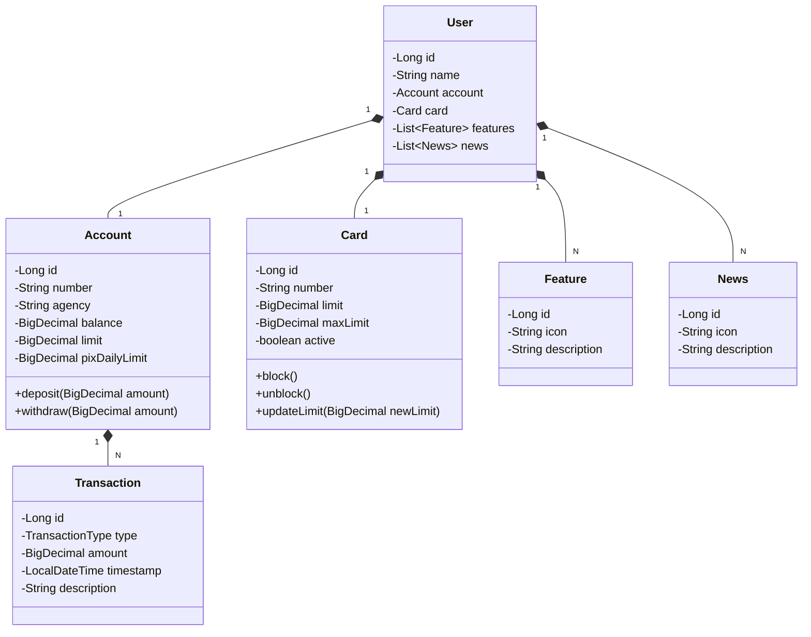

# Claro Dev Week 2026 API - Clean Architecture & DDD

Esta é uma evolução da API RESTful desenvolvida durante o bootcamp **Claro Dev Week 2026** (com base na Santander Dev Week 2023), migrada para **Java 21**, **Spring Boot 3.3.4** e reestruturada sob os padrões de **Clean Architecture (Arquitetura Limpa)** e **Domain-Driven Design (DDD)**.

---

## 🏛️ Arquitetura do Projeto

O projeto foi dividido em quatro camadas isoladas que garantem o desacoplamento total das regras de negócio em relação a frameworks e bibliotecas externas:

```
                               ┌────────────────────────────────┐
                               │          Presentation          │
                               │  - Controllers & DTO Records   │
                               └───────────────┬────────────────┘
                                               │ (usa)
                               ┌───────────────▼────────────────┐
                               │           Application          │
                               │  - Use Cases & Services (Puro) │
                               └───────────────┬────────────────┘
                                               │ (usa)
                               ┌───────────────▼────────────────┐
                               │             Domain             │
                               │  - Entities & Ports (Puro)     │
                               └───────────────▲────────────────┘
                                               │ (implementa)
                               ┌───────────────┴────────────────┐
                               │         Infrastructure         │
                               │  - JPA, Security, OpenFeign    │
                               └────────────────────────────────┘
```

1. **Domain (Domínio):** Regras de negócio e contratos puros em Java (Entities, Value Objects e Repositories). Totalmente livre de anotações JPA ou importações de frameworks.
2. **Application (Aplicação):** Implementação dos Casos de Uso (Services) puros em Java que orquestram os fluxos do negócio.
3. **Presentation (Apresentação):** Controladores REST e DTOs (Java Records) utilizando as facilidades web do Spring Boot.
4. **Infrastructure (Infraestrutura):** Adaptadores de persistência (JPA Entities, Repositórios Spring Data), segurança de rotas (Spring Security), chamadas HTTP externas (OpenFeign) e injeção de dependências do framework.

---

## 💡 Funcionalidades e Regras de Negócio Implementadas

1. **Cadastro e Busca de Usuários:** Operações CRUD básicas estruturadas através de Casos de Uso.
2. **Transferências via Pix:**
   - Validação de saldo da conta de origem (incluindo limite especial).
   - Validação de **limite diário Pix** configurado no domínio para prevenção de fraudes.
3. **Histórico de Transações (Extrato):** Registro automático de depósitos, saques e transferências de entrada/saída associadas a cada conta.
4. **Gerenciamento de Cartões:**
   - Bloqueio e desbloqueio lógico do cartão de crédito.
   - Ajuste de limite de crédito condicionado a regras de aprovação máxima e status do cartão no domínio.
5. **Insights com Inteligência Artificial:** Integração via OpenFeign com serviço externo de conselhos/dicas financeiras personalizadas como fallback de IA.

---

## 🛠️ Principais Tecnologias
- **Java 21 (LTS):** Uso de Java Records e novos recursos de JVM.
- **Spring Boot 3.3.4:** Inicialização e orquestração de beans de infraestrutura.
- **Spring Data JPA & PostgreSQL/H2:** Persistência relacional em banco de dados.
- **Spring Security:** Autenticação básica de rotas via HTTP Basic Auth.
- **Spring Cloud OpenFeign:** Clientes HTTP declarativos.
- **OpenAPI / Swagger (Springdoc):** Documentação interativa dos endpoints.
- **JUnit 5 & Mockito:** Suite completa de testes automatizados do core.

---

## 📊 Diagrama de Classes do Domínio (Mermaid)



---

## ⚡ Como Rodar o Projeto Localmente

1. Clone este repositório.
2. Certifique-se de possuir o **JDK 21** configurado no seu sistema.
3. Para compilar e executar todos os testes unitários do core, rode:
   ```bash
   ./gradlew test
   ```
4. Para iniciar a API localmente:
   ```bash
   ./gradlew bootRun
   ```
5. Acesse o console do banco H2 em: `http://localhost:8080/h2-console`
6. Acesse a documentação Swagger e teste os endpoints interativamente em: `http://localhost:8080/swagger-ui/index.html`
   - *Autenticação Padrão:* Usuário `admin` e Senha `admin`.

---

## 🎨 Links de Referência
- **[Figma Original do Projeto](https://www.figma.com/file/0ZsjwjsYlYd3timxqMWlbj/SANTANDER---Projeto-Web%2FMobile?type=design&node-id=1421%3A432&mode=design&t=6dPQuerScEQH0zAn-1)** (Utilizado para abstração inicial do domínio).
- **Mock de Backup da DIO:** https://digitalinnovationone.github.io/santander-dev-week-2023-api/mocks/find_one.json
